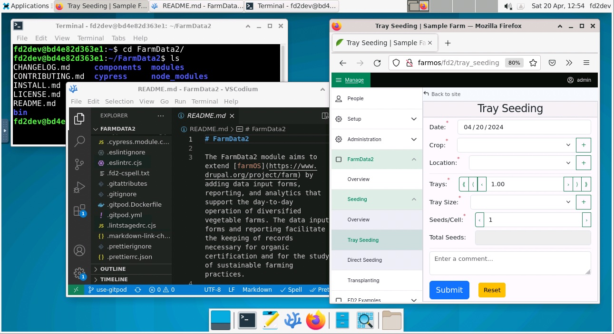

<h1>The FarmData2 Development Environment</h1>

<h3>The Development Enviornment is Ready</h3>

<table>
    <tr>
        <td width=50% valign="top">
            <u><h3>Open in your Browser1</h3></u>
            Click here to <a href="https://%CODESPACE_NAME%-6901.app.github.dev?autoconnect=true&resize=remote" target="_blank">Open the Development Environment in a Browser Tab</a>.
             
            <u><h3>Open on your Machine with VNC2,3</h3></u>
            In a terminal on your machine:
            <ol>
                <li><code>gh cs ports forward 5901:5902 -c %CODESPACE_NAME%</code></li>
                <li>Use a VNC client to connect to <code>localhost:5902</code></li>
            </ol>
        </td>
        <td valign="center">
            

                
            

        </td>
    </tr>
    <tr>
        <td colspan=2>
             
            <i>Notes:</i> 
            <ol>
                <li>
                    The browser based version of the Development Environment has the limitation that you cannot copy and paste between the Development Environment and your machine. Using a VNC client on your machine as described in Note #2 removes this limitation.
                </li>
                <li>
                    Opening in VNC requires that both the `gh` command line interface and a VNC client be installed on your machine. You can find more information about each of these in the [INSTALL Document](../INSTALL.md) or at the following links:
                    <ul>
                        <li><a href="https://cli.github.com/">Installing `gh`</a>
                        <li><a href="https://sourceforge.net/projects/tigervnc/files/stable/1.13.0/">Installing Tiger VNC Client</a>
                    </ul>
                </li>
                <li>
                    The `gh cs ports forward 5901:5902` command forwards port `5901` in the codespace to port `5902` on your local machine to allow VNC to connet. If port 5902 is in use on your machine you can change `5902` to any available port. Then use your VNC client to connect to the new port.
                </li>
            </ol>
        </td>
    </tr>
</table>
