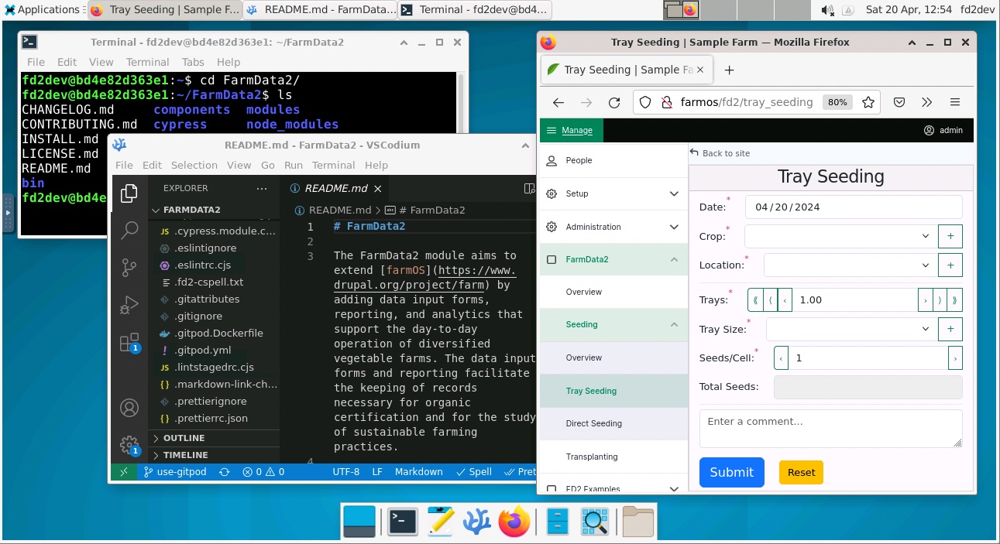

# Installing the FarmData2 Development Environment

This document describes the installation of the FarmData2 Development Environment. If you are interested in installing FarmData2 as a user, please see the [Using FarmData2](README.md#using-farmdata2) section in the [README.md](README.md) document.

FarmData2 provides a fully containerized Linux-based development environment for working on the FarmData2 project. Using this FarmData2 Development Environment ensures that you have the correct versions of all of the tools, libraries and other dependencies needed to do FarmData2 development.

**The Linux-based FarmData2 Development Environment.**

There are multiple ways to install the FarmData2 Development Environment.

- [Running the FarmData2 Development Environment in GitPod](docs/install/gitpod.md) - The quickest and easiest way to get started. This install runs entirely in the cloud so there are no dependencies to install on your machine. However, it cannot be used off-line and GitPod limits free usage to 50 hours per month.
- [Running the FarmData2 Development Environment Locally](docs/install/local.md) - This install has no free time limit and can be used off-line. However, it requires that your machine have sufficient resources (~16GB RAM and 8 CPU cores) and that you install a few dependencies on your machine.
- [Native Install of the FarmData2 Development Tools](docs/install/native.md) - Use of the FarmData2 Development Environment, either via GitPod or a local install is encouraged. However, if you strongly prefer to work directly on your local machine it is in theory possible to install all of the necessary dependencies natively. This approach is much more labor intensive and you may encounter significant difficulties that are dependent upon the versions of software installed on your local machine.
