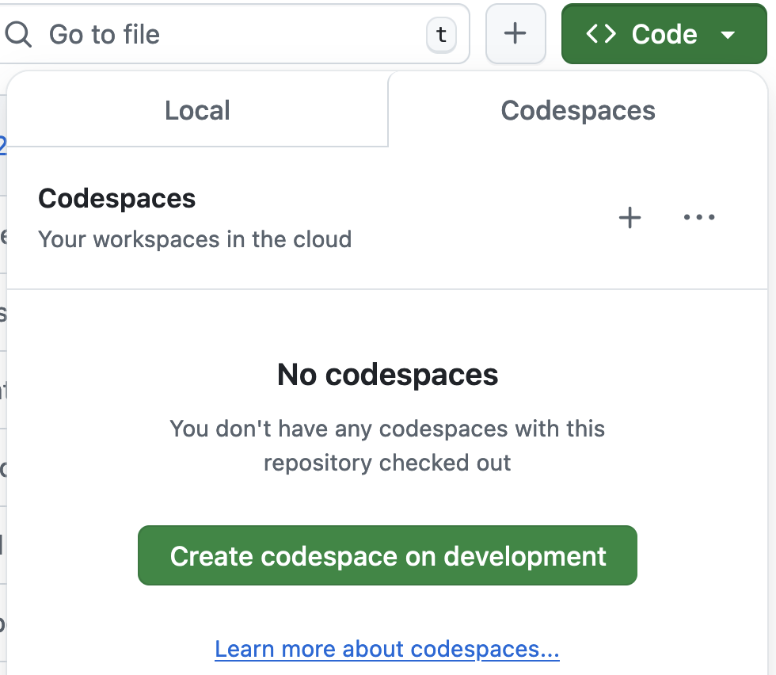
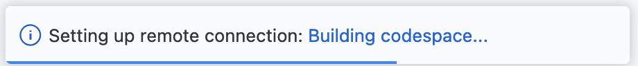
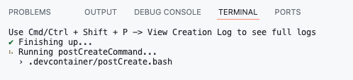
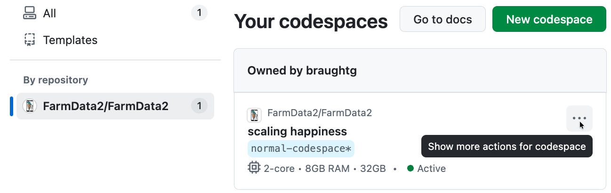
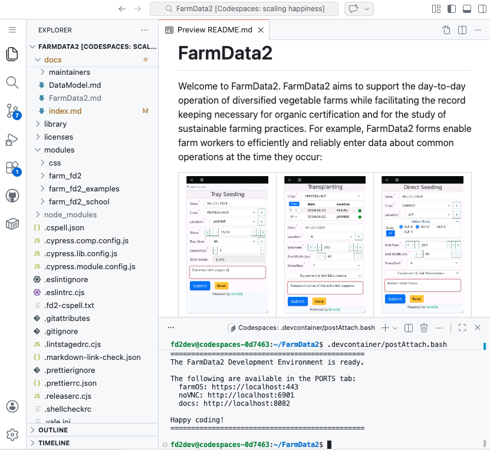
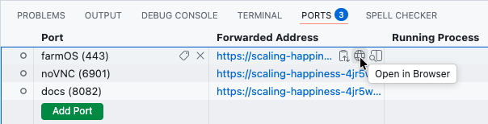
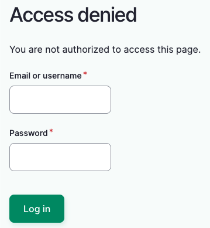
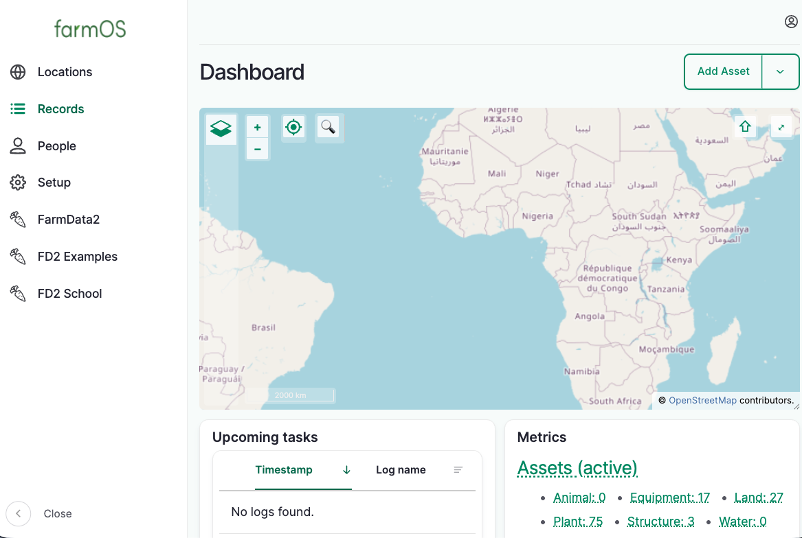
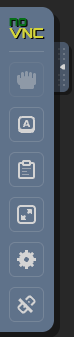
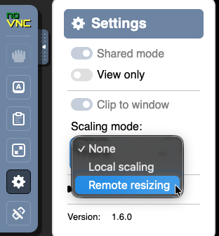

# Installing the FarmData2 Development Environment

This document describes how to run the FarmData2 Development Environment in a GitHub Codespace. If you are interested in installing FarmData2 as a user, see the [Using FarmData2](README.md#using-farmdata2) section in the [README.md](README.md) document.

## Install Help

If you run into problems during the install visit the dedicated [install channel](https://farmdata2.zulipchat.com/#narrow/channel/592674-Install) on the [FarmData2 Zulip chat](https://farmdata2.zulipchat.com). Use the search feature to see of others have had and solved the problem you are experiencing. If you do not find a solution, post a summary of your problem and the community will help.

## Creating a FarmData2 Codespace

When you first start work on FarmData2 you will need to create a new FarmData2 Codespace.

1. Login to your [GitHub account](https://github.com/login).

2. Fork the [upstream FarmData2 repository](https://github.com/FarmData2/FarmData2) in GitHub.

3. Find your fork of the FarmData2 repository in [your GitHub space](https://github.com/).

4. Click the <!-- vale RedHat.DoNotUseTerms = NO : the button label is also given -->green<!-- vale RedHat.DoNotUseTerms = YES --> "Code" button:  
   

5. Click the "Codespaces" tab and then click the <!-- vale RedHat.DoNotUseTerms = NO : the button label is also given -->green<!-- vale RedHat.DoNotUseTerms = YES --> button labeled "Create codespace on development."  
   

6. After a few moments the browser will change to show a Visual Studio Code interface and a small dialog box will appear in the lower right corner indicating that the GitHub Codespace is being built.  
   

7. Wait patiently… Creating the new Codespace takes some time (up to 10 minutes).

   - You can click the <!-- vale RedHat.DoNotUseTerms = NO : the button label is also given -->blue<!-- vale RedHat.DoNotUseTerms = YES --> "Building codespace…" text to display the output of the build process in the terminal if you want to see what is happening as the Codespace is built.

8. About half way through the installation the following message will be displayed in the terminal indicating the development container has been created and is now being configured:

   

9. When the Codespace is ready for use the following message will be displayed in the terminal:

   ```text
   ===============================================
   The FarmData2 Development Environment is ready.

   The following are available in the PORTS tab:
     farmOS: https://localhost:443
     noVNC: http://localhost:6901
     docs: http://localhost:8082

   Happy coding!
   ===============================================
   ```

   - Notes:
     - Starting to work before this message is displayed might result in errors.
     - If any errors have occurred the message will contain information about steps to take.

## Stopping / Restarting / Deleting your FarmData2 Codespace

Codespaces can be stopped, restarted and deleted from your [Codespaces page on GitHub](https://github.com/codespaces).



When a FarmData2 codespace is restarted, the "The FarmData2 Development Environment is ready" message will appear again, indicating that the codespace is ready for use.

- The [GitHub Codespaces documentation pages](https://docs.github.com/en/codespaces) provide more detail about stopping, starting and deleting Codespaces.
  - [Stopping and Starting a Codespace](https://docs.github.com/en/codespaces/developing-in-a-codespace/stopping-and-starting-a-codespace)
  - [Deleting a Codespace](https://docs.github.com/en/codespaces/developing-in-a-codespace/deleting-a-codespace)

## The Development Environment

The FarmData2 Development Environment has four main elements:

- The **Visual Studio Code IDE** that provides a code editor, debugger, terminal and access to CoPilot.
- A **running instance of farmOS** with the FarmData2 modules installed where code changes can be observed.
- A **noVNC server** that provides access to a GUI desktop that displays tests that are run the Cypress GUI test runner.
- The **documentation server** that is used to view the FarmData2 documentation.

These elements are accessed though the Codespace running in the browser.

### The Visual Studio Code IDE

When the Codespace for the FarmData2 Developer Environment opens a Visual Studio Code IDE interface is displayed with a clone of your FarmData2 repository open.

  

If you are new to the Visual Studio Code IDE, you might find the following resources helpful:

- A guide to the [Visual Studio Code IDE User Interface](https://code.visualstudio.com/docs/getstarted/userinterface)
- The [FarmData2 Quick Reference](./docs/contributing/quickReference.md), which includes a list of helpful keyboard shortcuts.

### The Running farmOS Instance

<!-- vale RedHat.Definitions = NO --> <!-- "PORTS" is not an acronym or abbreviation. -->

The running instance of farmOS with the FarmData2 modules installed is accessed from the _PORTS_ tab in the Visual Studio Code IDE.

1. Click "PORTS" at the top of the _Panel_, which is displayed at the bottom of the window.

2. Point at the "Forwarded Address" for the "farmOS (443)" port and click the small globe icon.  
   

3. The farmOS login window will open in a new browser tab.  
   

4. Use the credentials below to log in to the farmOS instance:

   - Username: `manager1`
   - Password: `farmdata2`

5. Logging in will take you to the farmOS Dashboard.  
   

   - In smaller browser windows the farmOS menu including _FarmData2_, _FD2 Examples_ and _FD2 School_ is hidden by default. Click the "more options" icon (&#9776;) in the top left corner of the window to display the farmOS menu.

6. If you are a new contributor you can take [A Quick Tour of FarmData2](docs/contributing/tour.md) to familiarize yourself with farmOS and the FarmData2 features.

### The noVNC Server

The noVNC Server provides a Linux desktop interface to the running Codespace that is used to display FarmData2 tests that are run in the Cypress GUI.

1. Click "PORTS" at the top of the _Panel_, which is displayed at the bottom of the window.

2. Point at the "Forwarded Address" for the "noVNC (6901)" port and click the small globe icon.

3. The noVNC window will open in a new browser tab.

4. Click the "Connect" button to open the GUI desktop in noVNC.

   - This desktop will initially be empty as no tests are running.

5. Enter the following command in a terminal in the Visual Studio Code IDE:

   ```Text
   test.bash --e2e --fd2 --live --glob=**/direct_seeding/*.e2e.cy.js --gui
   ```

6. Return to the "noVNC" tab in your browser.

   - After a few moments the Cypress testing GUI will open.

7. Click the "Start E2E Testing in Electron" button.

8. Click `direct_seeding.BedFeet.e2e.cy.js` to observe a test running in the Cypress testing GUI.

9. Click the "X" in the upper right corners of the Cypress testing windows to close them.

10. In larger browser windows the Linux desktop will not fill the available space. To make the desktop resize to fill the browser window:

    1. Open the "noVNC menu tab" at the left edge of the window.  
       

    2. Click the "Gear" icon and set the "Scaling Mode" to "Remote resizing."  
       

### The Documentation Server

The documentation server provides convenient access to the FarmData2 documentation.

1. Click "PORTS" at the top of the _Panel_, which is displayed at the bottom of the window.

2. Point at the "Forwarded Address" for the "docs (8082)" port and click the small globe icon.

3. The documentation server will open in a new browser tab and display the "Index of the FarmData2 Documentation."

4. Briefly browse the topics to familiarize yourself with the documentation that is available.

<!-- vale RedHat.Definitions = YES -->

## Using Visual Studio Code Locally

You can also create and work within a Codespaces by using your local Visual Studio Code IDE. If you are interested in doing so, see the [Using GitHub Codespaces in Visual Studio Code](https://docs.github.com/en/codespaces/developing-in-a-codespace/using-github-codespaces-in-visual-studio-code) documentation from GitHub.
