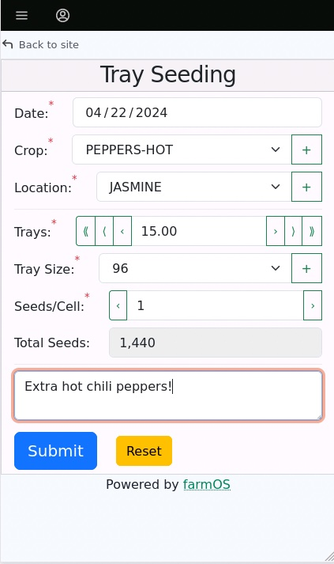
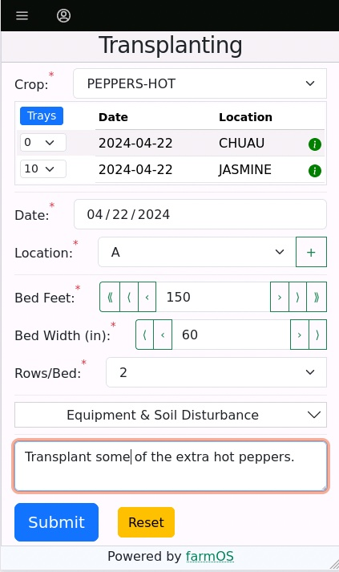
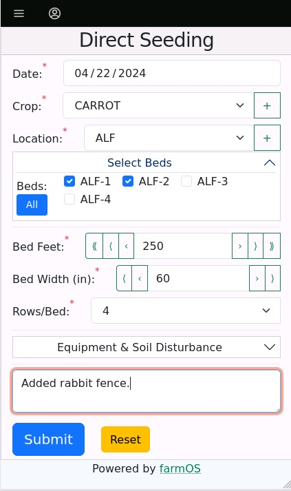

# FarmData2

Welcome to FarmData2. FarmData2 aims to support the day-to-day operation of diversified vegetable farms while facilitating the record keeping necessary for organic certification and for the study of sustainable farming practices. For example, FarmData2 forms enable farm workers to efficiently and reliably enter data about common operations at the time they occur:

<table border=0>
  <tr>
    <td>
      
    </td>
    <td>
      
    </td>
    <td>
      
    </td>
  </tr>
</table>

FarmData2 is not ready for production use. Current efforts are moving FarmData2 toward supporting a full growing season including seeding (tray, direct, cover crop), transplanting, soil amendment and disturbance, and harvesting.

## Using FarmData2

FarmData2 is a plugin module for [farmOS](https://www.drupal.org/project/farm) and requires a running instance of farmOS (3.0 or later) and an internet connection.

If you are familiar with hosting docker and database-backed websites you can [host your own instance of farmOS](https://farmos.org/hosting/install/). You can then install the latest release of the [FarmData2 Drupal Module](https://www.drupal.org/project/farmdata2) into your farmOS instance.

For those preferring a managed approach, [Farmier](https://farmier.com/) offers a subscription service where they create and host farmOS instances. FarmData2 hopes to be available on Farmier hosted instances of farmOS soon.

## Help and Communications

The FarmData2 community communicates on the [FarmData2 Zulip Chat](https://farmdata2.zulipchat.com). Feel free to get in touch there with questions, comments, and suggestions.

Feature requests and bug reports related to the operation of FarmData2 can reported in the [FarmData2 Issue Tracker](https://github.com/FarmData2/FarmData2/issues) on GitHub or discussed in the [FarmData2 Zulip Chat](https://farmdata2.zulipchat.com).

## FarmData2 Technologies

<!-- vale Google.Colons = NO -->
<!-- Words following colon here should be capitalized -->

FarmData2 is a plugin module for [farmOS](https://farmos.org/). farmOS is a [Drupal](https://www.drupal.org/) application, but FarmData2 typically does not require knowledge of Drupal. Most of FarmData2 development will use web development technologies including: HTML, CSS, JavaScript, Vue.js, BootstrapVueNext. Other technologies used in FarmData2 include: GitHub flavored Markdown, JSDoc, Cypress, Bash scripts, Docker, Vite, git hooks, GitHub actions and npm.

<!-- vale Google.Colons = YES -->

## Contributing to FarmData2

If you are considering contributing to the development of FarmData2, the sequence of steps outlined in the [Contributing Guide](CONTRIBUTING.md) are a great way to get started.

If you are returning or looking for a specific part of the documentation, the [FarmData2 Documentation Index](docs/index.md) provides a comprehensive set of links to all the documentation.

## Support for FarmData2

FarmData2 is thankful to the following organizations for their in-kind and financial support.

<!-- vale RedHat.Definitions = NO -->
<!-- Acronyms here seems acceptable -->

- [Dickinson College](https://www.dickinson.edu/)
- [farmOS](https://farmos.org/)
- [The GNOME Community Engagement Challenge](https://www.gnome.org/challenge/)
- [The National Science Foundation (DUE-2013069)](https://www.nsf.gov/awardsearch/showAward?AWD_ID=2013069)
- [The Non-Profit FOSS Institute](https://npfi.org/)
- [PASA Sustainable Agriculture](https://pasafarming.org/)
- [Zulip](https://zulip.com)

<!-- vale RedHat.Definitions = YES -->

## Licensing

<!-- vale write-good.Passive = NO -->
<!-- The phrasing of "are released under" is the common usage -->

 All textual materials in the FarmData2 project are released under a [Creative Commons Attribution-ShareAlike 4.0 International License](http://creativecommons.org/licenses/by-sa/4.0/)

 All code in the FarmData2 project is released under the [GNU General Public License Version 3 or later](https://www.gnu.org/licenses/gpl.txt).

<!-- vale write-good.Passive = YES -->

Complete information about the licenses and agreements that apply to the FarmData2 repository is in the [LICENSE.md](LICENSE.md) file.
