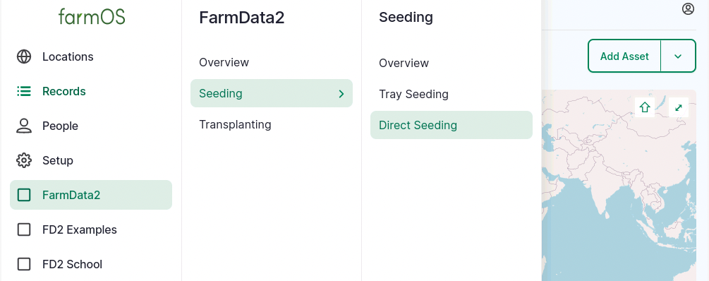
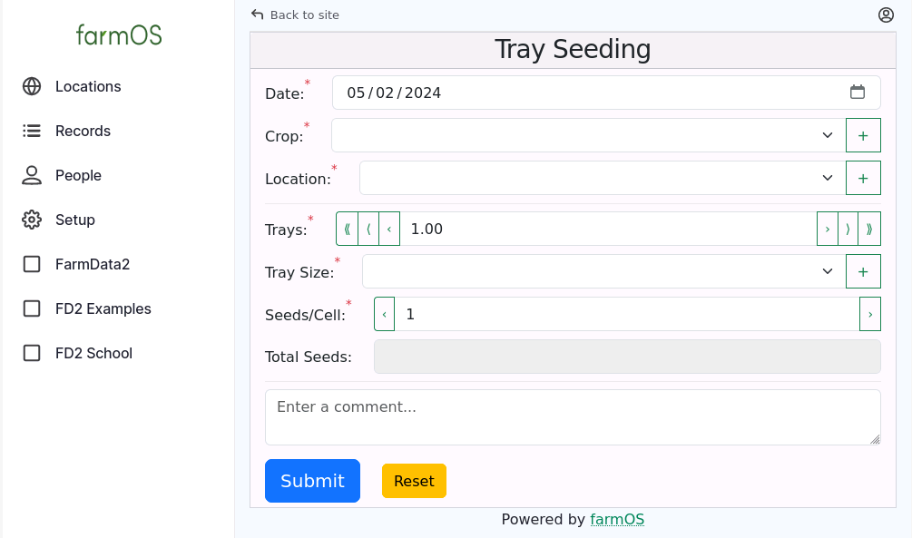
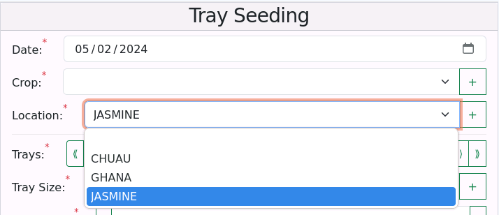

# Overview of the FarmData2 Codebase

This document provides a high level overview of the organization of the FarmData2 codebase, and the tools and technologies that are used.

<!-- vale Google.Colons = NO -->
<!-- Words following colon here should be capitalized -->

The primary product of the FarmData2 project is the FarmData2 module for [farmOS](https://farmos.org/) that provides data entry forms such as those shown in the [FarmData2 README](../../README.md).

The FarmData2 module is written in [JavaScript](https://developer.mozilla.org/en-US/docs/Web/JavaScript) with [Vue.js v3](https://vuejs.org/) and [BootstrapVueNext](https://bootstrap-vue-next.github.io/bootstrap-vue-next/). A working knowledge of [HTML](https://developer.mozilla.org/en-US/docs/Web/HTML) and [CSS](https://developer.mozilla.org/en-US/docs/Web/CSS) are also required for FarmData2 module development. FarmData2 accesses its data through the [farmOS.js library](https://github.com/farmOS/farmOS.js), which provides a JavaScript wrapper around the [farmOS API](https://farmos.org/development/api/). While farmOS is a [Drupal](https://www.drupal.org/) application and the FarmData2 module is a Drupal module, FarmData2 development typically does not require Drupal knowledge.

The infrastructure and development environment for the FarmData2 module uses several other tools and technologies. Is uses [GitHub flavored Markdown](https://docs.github.com/en/get-started/writing-on-github/getting-started-with-writing-and-formatting-on-github/basic-writing-and-formatting-syntax) for writing documentation and [JSDoc](https://jsdoc.app/) with [jsdoc-to-markdown](https://github.com/jsdoc2md/jsdoc-to-markdown/wiki) for documenting library code and Vue.js components. It uses the [Cypress](https://www.cypress.io/) testing framework for unit testing, Vue Component Testing, and End-to-End Testing. [Bash scripts](https://www.gnu.org/software/bash/manual/bash.html) automate common tasks. A postgres database, a farmOS instance and the FarmData2 Development Environment run in [Docker containers](https://docs.docker.com/). Dependencies within the FarmData2 Development Environment are manages with [npm](https://docs.npmjs.com/). [Git hooks](https://git-scm.com/book/en/v2/Customizing-Git-Git-Hooks), [GitHub actions](https://docs.github.com/en/actions), and [Vite](https://vitejs.dev/guide/) automate testing, linting and the building of releases.

<!-- vale Google.Colons = YES -->

All development for FarmData2 occurs in the [FarmData2 Organization on GitHub](https://github.com/FarmData2). The main repositories within that organization include:

- [FarmData2](https://github.com/FarmData2/FarmData2) - The FarmData2 Drupal module and two other Drupal modules used in the FarmData2 Development Environment.
- [FD2-Images](https://github.com/FarmData2/FD2-Images) - Configures and builds the Docker images including postgres, farmOS and the FarmData2 Development Environment.
- [FD2-SampleDBs](https://github.com/FarmData2/FD2-SampleDBs) - Configures and builds the example database that is used in the FarmData2 Development Environment for development and testing.

This document provides an overview of the FarmData2 repository. Most development does not require changes to the other two repositories, but when it does, see their specific documentation.

## The FarmData2 Repository

The [FarmData2 repository](https://github.com/FarmData2/FarmData2) contains all the source code, infrastructure, and documentation needed to develop, build and release the FarmData2 module.

### Key Terminology

FarmData2 contains three [_modules_](#modules) (FarmData2, FD2 Examples, and FD2 School). Each module contains [_entry points_](#entry-points) that provide FarmData2 functionality (Tray Seeding, Direct Seeding, Transplanting). The entry points use [_components_](#components) to collect and display information. [_Libraries_](#libraries) contain JavaScript functions that are used by the components and entry points.

#### Modules

The term _module_ in FarmData2 refers to a Drupal module that is a plugin to farmOS. FarmData2 contains three modules:

- FarmData2 - the module containing the FarmData2 user application including data entry forms such as those shown in the [FarmData2 README](../../README.md).
- FD2 Examples - a module containing examples that are useful when doing FarmData2 development. For example, there is an example showing how to use each of the custom Vue Components in FarmData2.
- FD2 School - a module that provides a workspace for a collection of onboarding activities that help to prepare students and other new developers to contribute to FarmData2.

FarmData2 is structured such that most development is isolated from the details of the Drupal modules. This enables FarmData2 developers to work with standard web development technologies (HTML, CSS, JavaScript, Vue.js, BootstrapVueNext) without the need to know Drupal.

#### Entry Points

Each module in FarmData2 contains _entry points_. Each entry point is a Vue.js application that creates a page or data entry form within farmOS. The entry points are accessed by a menu items that appear in the farmOS menu. For example, each of the forms shown in the [FarmData2 README](../../README.md) (Tray Seeding, Transplanting, Direct Seeding) are entry points in the FarmData2 module and appear in teh farmOS menu.

Similarly, the farmOS menus for FD2 Examples and FD2 School contain options for the entry points that they contain.

More detailed information about working on entry points is contained in the guide to [Working on an Entry Point](entry-points.md).

#### Components

The term _component_ in FarmData2 refers to a Vue.js Component. Components are used to collect and display information in the pages created by the entry points. For example, the Tray Seeding entry point uses components for: date, crop, location, number trays, tray size, the of seeds per cell and the total number of seeds used. The submit and reset buttons are also components.

Sometimes these components are used directly from the [BootstrapVueNext](https://bootstrap-vue-next.github.io/bootstrap-vue-next/) library. But more frequently they are one or more of the BootstrapVueNext components wrapped in a custom Vue component that performs a specific task in FarmData2. For example, the custom component used to select a Location includes the label ("Location"), the "\*" that shows the location is required, and the dropdown menu that contains the list of available locations.

More detailed information about working on Vue Components is contained in the guide to [Working on a Vue.js Component](components.md).

#### Libraries

The term _library_ in FarmData2 refers to a collection of JavaScript functions that are used by the components and entry points. For example, the `farmosUtil` library contains functions that simplify the interaction with the farmOS instance to store and retrieve information.

More detailed information about working on libraries is contained in the guide to [Working on a Library](libraries.md).

#### Infrastructure

The term _infrastructure_ in FarmData2 refers to all the tools and configuration that are used to perform tasks such as running, building, testing, and linting the FarmData2 codebase. For example, Docker, Vite, Cypress, eslint, Vale, git and GitHub are all part of the FarmData2 infrastructure.

More detailed information about working on the FarmData2 infrastructure is contained in the guide to [Working on Infrastructure](infrastructure.md).

### Repository Structure

The most important directories in the FarmData2 repository are shown in the following directory tree. Each link jumps to a description of the purpose of the directory.

<pre>
FarmData2
├── <a href="#githooks-directory">.githooks</a>
├── <a href="#github-directory">.github</a>
├── <a href="#vale-directory">.vale</a>
├── <a href="#vscode-directory">.vscode</a>
├── <a href="#bin-directory">bin</a>
├── <a href="#components-directory">components</a>
│   ├── BedPicker
│   ├── CommentBox
│   └── ...
├── <a href="#cypress-directory">cypress</a>
├── <a href="#docker-directory">docker</a>
├── <a href="#docs-directory">docs</a>
│   ├── components
│   ├── contributing
│   ├── install
│   └── library
│   └── ...
├── <a href="#library-directory">library</a>
│   ├── farmosUtil
│   ├── uiUtil
│   └── ...
├── <a href="#licenses-directory">licenses</a>
├── <a href="#modules-directory">modules</a>
│   ├── css
│   ├── farm_fd2
│   │   ├── dist
│   │   └── src
│   │       ├── entrypoints
│   │       │   ├── direct_seeding
│   │       │   ├── main
│   │       │   ├── seeding
│   │       │   ├── transplanting
│   │       │   ├── tray_seeding
│   │       │   └── ...
│   │       ├── module
│   │       └── public
│   ├── farm_fd2_examples
│   │   └── ...
│   └── farm_fd2_school
│       └── ...
└── ...

ASCII directory tree was generated by <a href='http://tree.nathanfriend.io'>https://tree.nathanfriend.io</a>.
</pre>

#### Directory Descriptions

##### `.githooks` Directory

- The `.githooks` directory contains Git hooks that prevent common mistakes and run the `pre-commit` checks before committing changes to the repository.

  [Back to Tree](#repository-structure)

##### `.github` Directory

- The `.github` directory contains GitHub templates and actions. For example, new pull requests are pre-populated with content headers and the licensing certification. The `release.yml` workflow file in this directory builds a pre-release when code is merged into the `development` branch and a full release when code is merged into the `production` branch.

  [Back to Tree](#repository-structure)

##### `.vale` Directory

- The `.vale` directory contains the style guides that are used by the Vale prose linter. This directory is created locally and populated by the `bin/setup.bash` script and is not committed to the FarmData2 repository.

  [Back to Tree](#repository-structure)

##### `.vscode` Directory

- The `.vscode` directory contains the configuration for VSCodium (the open source version of Visual Studio Code). The configuration includes some settings and the list of recommended extensions. The recommended extensions are installed by the `bin/setup.bash` script.

  [Back to Tree](#repository-structure)

##### `bin` Directory

- The `bin` directory contains Bash scripts that are used to automate common tasks. For example, starting and stopping the development environment, creating a new component or entry point, running tests, and building the code documentation. The `bin` directory is on the `PATH` in the FarmData2 Development Environment, allowing the scripts can be run from any working directory.

  [Back to Tree](#repository-structure)

##### `components` Directory

- The `components` directory contains one directory for each custom Vue.js component in FarmData2. For example, the code and tests for the `BedPicker` component are contained in the `components/BedPicker` directory.

  See the guide to [Working on a Vue.js Component](components.md) for more information about creating, modifying, and testing components.

  [Back to Tree](#repository-structure)

##### `cypress` Directory

- The `cypress` directory contains shared Cypress resources including custom Cypress commands defined in the `support/commands.js` file. The `FarmDat2` directory also contains Cypress configuration files for unit tests (`.cypress.lib.config.js`), component tests (`.cypress.comp.config.js`), and end-to-end tests (`.cypress.module.config.js`).

  [Back to Tree](#repository-structure)

##### `docker` Directory

- The `docker` directory contains the `docker-compose.yml` file that configures the Docker images that makeup the FarmData2 Development Environment. The images are built by the code in the [FD2-Images](https://github.com/FarmData2/FD2-Images) repository. The `docker` directory also contains the `db` directory, which holds the Postgres database that used by farmOS. The `db` directory is a Docker Volume that is mounted into all containers in the FarmData2 Development Environment. The `db` directory is not committed to the FarmData2 repository.

  [Back to Tree](#repository-structure)

##### `docs` Directory

- The `docs` directory contains most of the documentation for the FarmData2 repository. Though, the standard documentation files (`CHANGELOG.md`, `CONTRIBUTING.md`, `INSTALL.md`, `LICENSE.md`, and `README.md`) can still be found in the repository root.

  The `docs/components` and `docs/libraries` directories contain documentation for FarmData2's custom Vue.js components and its JavaScript libraries. The documentation in these directories is created by the `bin/setup.bash` script and they are not committed to the FarmData2 repository. More information about writing component or library documentation can be found in the appropriate guide:

  - [Working on a Vue.js Component](components.md)
  - [Working on a JavaScript Library](libraries.md)

  The `docs/install` directory contains the installation instructions for the FarmData2 Development Environment. The `docs/contributing` directory contains information about contributing to the various parts of the FarmData2 project including: components, libraries, end points, documentation, and infrastructure. More information about writing textural documentation can be found in the guide:

  - [Working on Documentation](documentation.md)

  [Back to Tree](#repository-structure)

##### `library` Directory

- The `library` directory contains one directory for each JavaScript library in FarmData2. For example, the code and tests for the `farmosUtil` library are contained in the `library/farmosUtil` directory.

  See the guide to [Working on a JavaScript Library](libraries.md) for more information about creating, modifying, and testing libraries.

  [Back to Tree](#repository-structure)

##### `licenses` Directory

- The `licenses` directory contains copies of each of the licenses that are used by FarmData2. The [LICENSE.md](../../LICENSE.md) file describes in detail how each of the licenses are used.

  [Back to Tree](#repository-structure)

##### `modules` Directory

- The `modules` directory contains a `css` directory and one directory for each module in FarmData2 (`farm_fd2`, `farm_fd2_examples`, `farm_fd2_school`).

  The `css` directory contains css that is shared across the modules and their entry points.

  The directory for each module has the same internal structure:

  - The `dist` directory contains a built version of the associated Drupal module. The `dist` directory is created by the `setup.bash` script when it performs an initial build of each module. Modules are rebuilt as necessary as their code or dependencies are modified. This directory is not committed to the FarmData2 repository.
  - The `src` directory contains the source code for the module including:
    - The `entrypoints` directory. This directory contains one directory for each entry point in the module (`direct_seeding`, `main`, `seeding`, `transplanting`, `tray_seeding`). The directory for each entry point then contains the source code and tests for its Vue application.
    - The `module` directory. This directory, along with the `src/composer.json` file, contains the code and configuration necessary to create the Drupal module containing the module's entry points.
    - The `public` directory contains some static assets that are added to the built Drupal module.

  See the guide to [Working on entry-points](entry-points.md) for more information about modules and creating, modifying, and testing the entry points that they contain.

  [Back to Tree](#repository-structure)
