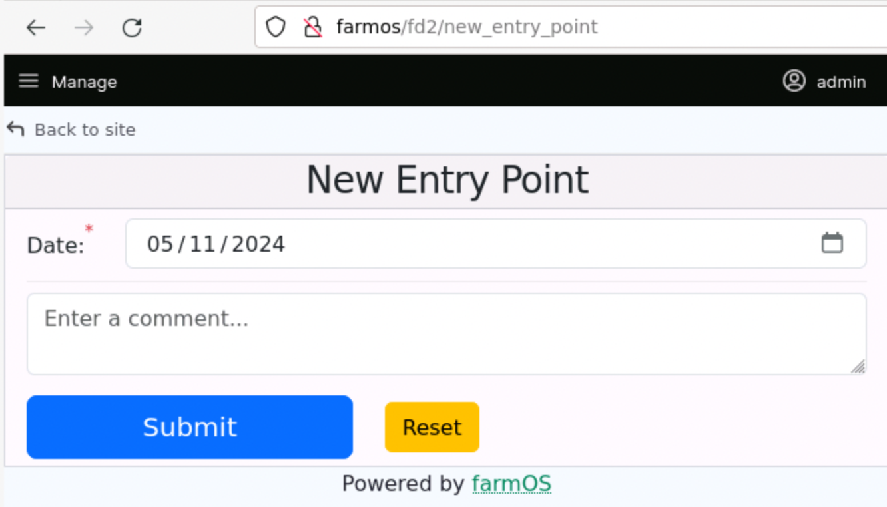

# Working on Entry Points

Entry points are pages that are accessed through the FarmData2 menus (FarmData2, FD2 Examples, FD2 School) in farmOS. For example, the Tray Seeding, Direct Seeding and Transplanting menu options lead to pages (entry points) for collecting data about the corresponding activity.

Familiarity with the [Overview of the FarmData2 Codebase](codebase.md) will be helpful in reading this document.

## Outline

- [Entry Points](#entry-points)
  - [Creating the New Entry Point](#creating-the-new-entry-point)
  - [Finding the New Entry Point](#finding-the-new-entry-point)
    - [Finding the New Entry Point in farmOS](#finding-the-new-entry-point-in-farmos)
    - [Finding the New Entry Point in the Source Code](#finding-the-new-entry-point-in-the-source-code)
  - [Watching a Module](#watching-a-module)
  - [Running Entry Point Tests](#running-entry-point-tests)
    - [Running Unit Tests](#running-unit-tests)
    - [Running End-to-End Tests](#running-end-to-end-tests)

## Entry Points

The following sub-sections describe how to create, change and test entry points in FarmData2.

### Creating an Entry Point

Running `addEntryPoint.bash` script will guide you through the creation of a new entry point. This script prompts for the following information and then uses it to create the new entry point:

1. **The module** in which to create the new entry point. The entry point can be created in the `farm_fd2`, `farm_fd2_examples`, or `farm_fd2_school` module, which correspond to the similarly named FarmData2 menus in farmOS.
1. **The name** for the new entry point. This name is used internally in code and is not visible to users. The name should be entered in `snake_case`, with words being all lowercase and separated by underscore (`_`) characters.
1. **A short title** for the new entry point. The title is the text that will be used as the menu option for accessing the entry point. It also appears at the top of the entry point page. The title should be in Title Case, with words capitalized and separated by spaces. This often uses the same words as the name.
1. A one sentence **description** of the new entry point. This description is used as a tooltip by Drupal and should be written to be meaningful to a user.
1. The **parent menu** on which the option for this entry point should be added. The title for this entry point will appear on the specified menu.
1. The **permissions** that a user must have to see the menu. The permissions that are available can be found by logging into farmOS as `admin` and visiting the [farmOS People page](http://farmos/admin/people/permissions). Then use the browser dev-tools to inspect the check boxes to find the name of the permission.

When you have entered the information and confirmed that you want to the new entry point, the scrip will create a new entry point by:

1. Creating and switching to a new feature branch named `add_<entry_point_name>_entry_point`
2. Creating a subdirectory in the module containing the new entry point.
3. Copying a set of template files for the entry point into the subdirectory.
4. Updating the module configuration to include the new entry point.
5. Running tests to confirm that the entry point was created.
6. Committing the template files to the feature branch.

This process can take several minutes.

### Finding the New Entry Point

#### Finding the New Entry Point in farmOS

Open Mozilla Firefox and login to farmOS at [http://farmos](http://farmos). Then use the FarmData2 menus to find the option for the module containing the template for the new entry point.

<a href="images/EntryPointTemplate.png"></a>

Note: if the entrypoint template page is blank, hold the "shift" key and click the reload button in the browser (&#10227;).

#### Finding the New Entry Point in the Source Code

The directory for the module in which the new entry point is being created will contain a new a subdirectory for the entry point's code. For example, creating an entry point named `new_entry_point` in the `farm_fd2` module will create the subdirectory `new_entry_point` as shown in the following directory tree:

<pre>
FarmData2
├── ...
├── modules
│   ├── ...
│   ├── farm_fd2
│   │   ├── dist
│   │   └── src
│   │       ├── entrypoints
│   │       │   ├── direct_seeding
│   │       │   ├── <strong>new_entry_point</strong>
│   │       │   ├── tray_seeding
│   │       │   ├── transplanting
|   |       :   :
|   |
│   ├── farm_fd2_examples
│   │   └── ...
│   ├── farm_fd2_school
│   │   └── ...
:   :
</pre>

The [Tour of an Entry Point](#tour-of-an-entry-point) section describes the new entry point template in detail.

### Implementing Entry Point Functionality

The functionality of the entry point template is customized to its intended purpose by adding components to the page in the `App.vue` file and implementing the `submitForm` function in the `lib.js` file.

The [Tour of an Entry Point](#tour-of-an-entry-point) section provides more detail and examples of how to customize the entry point template.

### Watching a Module

When the code associated with an entry point is changed, the module containing it must be rebuilt before the changes will appear in farmOS.

Most commonly you will want to _watch_ the module on which you are working. Watching the module causes it to be rebuilt any time changes are made to any of the files that it uses. To watch a module, open a new terminal and use the appropriate command for the module you want to watch:

- `npm run watch:fd2`
- `npm run watch:examples`
- `npm run watch:school`

Output in the terminal will show the module is rebuilt and any errors that occur.

The [Watch and Build Alternatives](#watch-and-build-alternatives) section describes other approaches to watching or building modules that might be useful or preferred in some circumstances.

### Running Entry Point Tests

The entry point template contains unit tests and end-to-end tests for its functionality. As more functionality is added to the entry point will need to be changed and more tests will need be added. [The Entry Point Test Files](#the-entry-point-test-files) section describes the conventions to be used for these tests.

#### Running Unit Tests

To run the unit tests for an entry point open a new terminal and adapt the following command:

```bash
test.bash --unit -- --gui < module > --glob=modules/**/ < entry_point_name > /*.unit.cy.js
```

- `<module>` must be one of `fd2`, `examples` or `school`.
- `<entry_point_name>` must be the name of the entry point to test.
- The `--gui` flag causes the tests to run in the Cypress GUI. Omit the `--gui` flag to run the tests _headless_ with results reported in the terminal.
- Omit the `--glob` flag to run the unit tests for all entry points in the module.

#### Running End-to-End Tests

To run the end-to-end (e2e) tests for an entry point open a new terminal and adapt the following command:

```bash
test.bash --e2e --live -- < module > --glob=modules/**/ < entry_point_name > /*.e2e.cy.js
```

- `<module>` must be one of `fd2`, `examples` or `school`.
- `<entry_point_name>` must be the name of the entry point to test.
- The `--gui` flag causes the tests to run in the Cypress GUI. Omit the `--gui` flag to run the tests _headless_ with results reported in the terminal.
- Omit the `--glob` flag to run the e2e tests for all entry points in the module.

## Tour of an Entry Point

### Entry Point Directory Structure

### Entry Point Code

#### The `App.vue` File

#### The `lib.js` File

#### The Entry Point Test Files

##### Entry Point Unit Tests

##### Entry Point End-to-End Tests

## More Details

### Testing Tips

### Permissions

### Pre-populating farmOS Data

### Module Structure

### Watch and Build Alternatives

#### The Dev Server

#### The Preview Server

#### Builds

=== Raw Notes Below ===

## Modules

The FarmData2 modules

- farm_fd2 - the main FarmData2 module.
- farm_fd2_examples - the FarmData2 examples module.
- farm_fd2_school - the FarmData2 school module.

- cypress - cypress configuration shared by all modules.
- cypress.config.js - cypress configuration shared by all modules.
  - these are sym linked inside each module directory.

## Module Structure

Inside each of the above module directories there are the following directories and files:

- src - contains all source code for the module
- cypress - symbolic link to the `cypress` directory in modules
  - all modules share same configuration for cypress
- cypress.config.js - symbolic link to the `cypress.config.js` file in modules
  - all modules share same configuration for cypress
- vite.config.js - the vite build configuration for the module.
- dist - distribution files for the module
  - generated by the vite build
- src/entrypoints - all of the entrypoints (i.e. pages) in the module.
  - one sub-directory for each entry point.
  - entry point names must be unique within a module.
    - created with bin/addEntrypoint.bash
      - App.vue - code for the entrypoint (you edit this).
      - \*.cy.js - tests for the entrypoint (you create these)
      - index.html - scaffolding (auto generated by bin/addEntrypoint.bash)
      - main.js - scaffolding (auto generated)
  - module - scaffolding (auto edited by bin/addEntrypoint.bash)
  - public - scaffolding
  - shared - scaffolding
  - stores - used by Vue pinia store
  - composer.json - Drupal configuration information (only for farm_fd2)

## Adding an new Entry Point

- ensure you have no uncommitted changes
- switch to `development` branch
- run `addEntrypoint.bash`
  - Will create a new feature branch
  - Switch to that branch
  - Add boilerplate and starter code to it
  - Run some basic tests against the added code
    - Note: running test script also builds the module containing the new entry point.
- Edit `App.vue` to implement the entry point.
- Add `\*.cy.js` files to test the new entry point.

## Rebuilding Modules

- run
  - `npm run build:fd2`
  - `npm run build:examples`
  - `npm run build:school`

## Entry Point Conventions

Document where these things are in the code somehow.

- an example in the Examples module?

- all elements have `id` and `data-cy` attributes

  - prefixed with the entry point name
  - cabob-case
  - e.g. `direct-seeding-toaster`

- all use the `fd2-mobile.css` stylesheet.

  - add `<style scoped>` to the `App.vue` for entry point specific styles.

- Submit button is initially enabled.

  - On click
    - validity styling is shown
    - disabled if
      - any data is invalid
      - any required data is missing
    - Submitting ... banner appears while submitting.
    - Success banner appears when submitted is complete, stays for 2 seconds.
    - Error banner appears if there is an error, stays for 5 seconds.

- Errors are thrown by the `lib.js` file when doing submission (see `tray_seeding/lib.js`).

  - The main `App.vue` then catches the error and displays an error banner with a simplified message for the page.
  - The `lib.js` should print more detailed information to the console for debugging.

- Components indicate errors by emitting an `error` event with the error message.
  - A `v-on:error="(msg) => showErrorToast('Title', msg)"` listener should be attached to any component that emits an error event. The title should be generalized to the entrypoint. The component will have printed more detailed information to the console for debugging. See `tray_seeding/App.vue` for an example.

## farmOS Permissions Checking

A component can check the permissions of the logged in farmOS user using appropriate function in `farmosUtil.js`.

If a permission needs to be checked that is not yet supported it can be added to the `$perms` array in the `permissions` function in `modules/farm_fd2/src/module/Controller/FD2_Controller.php` file.

## Log Categories and Units

The log categories and units used by FarmData2 are installed by the `farm_fd2.install` file in `modules/farm_fd2/src/module`.

To add new log categories or units:

- Edit the `farm_fd2.install` file.
- Rebuild the module.
- Uninstall the FarmData2 module (machine name: `farm_fd2`)
- Re-enable the Farmdata2 module.

Note: the `installDB.bash` script also uninstalls and re-enables the FarmData2 module. Thus, changes to the log categories and units will be reflected when tests are run headless.

## Testing

- use `bin/test.bash` (see its docs).

- Unit test vs e2e tests.

- use watch:fd2 by default and just run in live farmOS???

  - or should we use the dev server?
  - point to another document that discusses the use of the dev and preview servers.

- Any `it` with an `intercept` should include `{ retries: 4 }` to tolerate some of the flake that appears to go with `cy.intercept`.

Best practice is to [reset the database state before tests are run](https://docs.cypress.io/guides/references/best-practices#State-reset-should-go-before-each-test). Doing this before every test or even at the start of every file adds significantly to the runtime of the test suite. FarmData2 compromises by resetting the database to the DB that was most recently installed (i.e. using `installDB.bash`) before each test run. A test run is one cypress command (e.g. as is done by `test.bash --comp`). Any test that absolutely requires a clean database (i.e. cannot tolerate changes made by prior tests) can reset it in its `before` hook using the following code:

```Javascript
  before(() => {
    cy.task('initDB');
  });
```

You can change the database that will be used for testing by using the `installDB.bash` script manually prior to running the tests. This is useful when you want to run tests against a pre-release of the sample database. For example:

```bash
installDB.bash --release=v3.1.0-development.3 --asset=db.sample.tar.gz
```

Use: `cy.task('log', 'message')` to log messages to the console.
Use: `cy.task('logObject', obj)` to log an object to the console.

### Unit Testing

Write code for submission of the form to farmOS in the lib.js file and unit test it.

- Tests do not need to clean up as the db is reset when running headless.
- Can be explicitly reset for specific test files (as above) if necessary.

### E2E Testing

The `addEntryPoint.bash` script creates an `*.exists.e2e.cy.js` test file. It initially tests that admin can access the page. It should be augmented to test as follows:

- `*.exists.e2e.cy.js` - ensure that the entry point exists and is accessible
  - Check that user(s) with proper permission can access the page.
  - Check that user(s) without permission (if one exists) cannot access the page.
  - Check that the following standard elements exist on the page
    - BToaster, BCard, header (contains proper title), BForm
- `*.<component>.e2e.cy.js` - Component specific e2e tests with one test for each component in the entry point.
  - Check that the component initially
    - exists or not.
    - is visible or not.
    - is enabled or not.
  - Check things that are set by props:
    - label, required, default value, dropdown content, buttons etc...
    - no need to duplicate tests from component's own tests.
  - Test validity styling
    - submit and check for appropriate validity styling (valid or invalid or none)
    - may require that values be placed in non-required components to see style.
  - Test behavior of the component
    - increment/decrement buttons, become visible, invisible, etc.
    - no need to duplicate tests from component's own tests.
- `*.submitReset.e2e.cy.js` - Submit/reset component e2e tests
  - Test that buttons are
    - visible and are
    - in the enabled state.
  - Test enabling/disabling of submit button
    - Configure form with one field invalid (helper function that sets all fields to a valid value might help here.)
      - submit.
      - check submit disabled.
    - Make field valid, check submit enabled (don't submit)
    - Repeat for each field.
  - Test reset
    - set all elements to valid state
    - resets all elements to default state
- `*.submission.e2e.cy.js` - test submission of the form.
  - Test successful submit
    - configure form with all fields valid
    - submit
    - check:
      - creates all of the records
      - shows/hides submitting banner
      - resets form leaving "sticky" values in place.
      - shows/hides success banner
  - Test submit w/ error
    - shows/hides error banner

### Common Testing Gotchas

- `clear()` fields with content before `type()`ing in them
- `blur()` any field that was `type()`d in or `clear()`ed before doing a submit or relying on its value. If changing lots of fields, then only need to `blur` the last one.
- When setting or checking the value of a _selector_ or _numeric_ input be sure to get the element from the sub-component (e.g. `selector-input` or `numeric-input`). Some methods work on the parent component, but others do not. So, it is always safest to work with the `*-input` element itself.
- If a contained `data-cy` is unique to a page just use it. `cy.get`ting the parent element and using `find` may not work. Very strange behavior.
- To use `select()` on a component built on top of the `SelectorBase` component, you must use `cy.get(<component>).find('selector-input').select(<item>)`

## Entry point structure

- Main container is a Bootstrap-Vue-Next [_BCard_](https://bootstrap-vue-next.github.io/bootstrap-vue-next/docs/components/card)

- BOIL THIS DOWN TO A MINIMAL EXAMPLE...

```JavaScript
<script setup>
import dayjs from 'dayjs';
import CropSelector from '@comps/CropSelector/CropSelector.vue';
import * as uiUtil from '@libs/uiUtil/uiUtil.js';
</script>

<template>
  <BToaster />
  <BCard
    bg-variant="light"
    header-tag="header"
  >
    <template #header>
      <h2 class="text-center">Tray Seeding</h2>
    </template>

    <BForm
      @submit="submit"
      @reset="reset"
    >
      <!-- Seeding Date -->
      <BFormGroup
        id="ts-date-group"
        label-for="ts-date"
        label-cols="auto"
        label-align="end"
        content-cols="auto"
      >
        <template v-slot:label>Date:<sup class="text-danger">*</sup> </template>
        <BFormInput
          id="ts-date"
          data-cy="ts-date"
          type="date"
          v-model="form.seedingDate"
          aria-describedby="date-help"
          required
        />
        <BFormText id="date-help">Date seeding occurred.</BFormText>
      </BFormGroup>

      <!-- Crop Selection -->
      <CropSelector
        required
        helpText="Select seeded crop."
        v-model:selected="form.crop"
        v-on:ready="createdCount++"
        v-on:error="
          (msg) =>
            uiUtil.showToast('Network Error', msg, 'top-center', 'danger', 5)
        "
      />

      <!-- Submit and Reset Buttons -->

      <!-- TODO: MAKE SO CAN'T SUBMIT AGAIN UNTIL A CHANGE HAS BEEN MADE -->
      <!-- POSSIBLY JUST CLEAR THE LOCATION OR THE CROP? -->
      <BRow>
        <BCol cols="8">
          <BButton
            type="Create"
            class="form-control"
            variant="primary"
            >Submit</BButton
          >
        </BCol>
        <BCol cols="4">
          <BButton
            type="Reset"
            class="form-control"
            variant="danger"
            >Reset</BButton
          >
        </BCol>
      </BRow>
    </BForm>
  </BCard>

  <div
    data-cy="page-loaded"
    v-show="false"
  >
    {{ pageDoneLoading }}
  </div>
</template>

<script>
export default {
  data() {
    return {
      form: {
        seedingDate: dayjs().format('YYYY-MM-DD'),
        crop: null,
      },
      createdCount: 0,
    };
  },
  methods: {
    submit() {
      console.log(this.form);
    },
    reset() {
      this.seedingDate = dayjs().format('YYYY-MM-DD');
      this.form.crop = null;
    },
  },
  computed: {
    pageDoneLoading() {
      return this.createdCount == 2;
    },
  },
  created() {
    this.createdCount++;
  },
};
</script>
```

Every entry point has a `<BToaster />` element as its first element.

- The `BToaster` allows alert/info/success/error messages to be displayed.

  - A message is displayed for 5 seconds on any error.
  - A submitting message is displayed when the form is submitted. This is dismissed when the submit was successful or an error occurred.
  - A success message is displayed for 1 second if the submit is successful.

  - Every FarmData2 component emits an `error` event with a message when an error occurs.
  - The entrypoint then must have an `on-error` handler that displays the Toast.

```JavaScript
v-on:error="(msg) => showToast('Network Error', msg, 'top-center', 'danger', 5)"
```

- Component / element naming:

  - Every component / element referenced in css or a test gets and `id` and a `data-cy`.
  - Values for the `id` and `data-cy` use `kabob-case`.

- Values for placement and variant should be documented by pointing to the Bootstrap-Vue-Next documentation

- Every entry point will import the `uiUtil` module

- All components are contained in a Bootstrap-Vue-Next [_Form_](https://bootstrap-vue-next.github.io/bootstrap-vue-next/docs/components/form) element.

  - Ideally all components will be FarmData2 components that wrap the Bootstrap-Vue-Next components to simplify their use in FD2.

- Every entry point contains some essential code that facilitates testing.

Every entry point has a data element with at least a `form`, a `validity` and a `createdCount` element:

- form contains values for each form element and are v-modeled to props.
- `validity` contains the validity of each form element and are set by `valid` event handlers.
  - all should be `null` to start.
  - used to determine if the form can be submitted.
  - also contains a `show` attribute bound to the `show-validity` prop
    - set to true to have component styled to show validity.
- createdCount is used to track when the entry point is ready to be used in tests.

```JavaScript
data() {
  return {
    form: {
      ...,
    },
    validity: {
      show: false,
      ...
    }
    createdCount: 0,
  };
},
```

The form will have an `isValid()` computed property that uses the `validity` values to set the `show-validity` prop of all of the components and to enable/disable the submit button.

Every API call made in created must increment `createdCount` when finished.

```JavaScript
created() {

  // once promise from API call resolves...
  this.createdCount++;
},
```

Every FarmData2 component emits a `ready` event when it is ready to be used in tests.

- Every component used must have a `v-on` handler for this event.

  - This handler increments the `createdCount`.

- Props that the entry point uses to affect the component state should be `v-model`ed to the data in `data.form`

```JavaScript
<CropSelector
  required
  helpText="Select seeded crop."
  v-model:selected="form.crop"
  v-on:ready="createdCount++"
  v-on:error="
    (msg) =>
      uiUtil.showToast('Network Error', msg, 'top-center', 'danger', 5)
  "
/>
```

Every entry point has a computed property that indicates when all API calls and components are ready.

```JavaScript
pageDoneLoading() {
  return this.createdCount == 2;
},
```

Every entry point template ends with the following `<div>` that uses the `pageDoneLoading()` property to indicate that the page is ready for testing.

```JavaScript
  <div
    data-cy="page-loaded"
    v-show="false"
  >
    { pageDoneLoading }}
  </div>
```

Cypress tests use `cy.waitForPage()` to wait for the entry point to fully load before running tests.

```JavaScript
describe('Sample test.', () => {
  it('Sample test.', () => {
    // Login if running in live farmOS.
    cy.login('admin', 'admin');
    // Go to the desired entry point.
    cy.visit('fd2/tray_seeding/');
    // Wait for everything to be ready before testing.
    cy.waitForPage();

    // Entry point is now fully loaded...
  });
});
```

- Include the following CSS in an entrypoint to optimize the entry point for mobile. This hides and reduces the space required for some of the farmOS UI elements. It reduces margins and borders to increase screen real estate.

```CSS
<style>
@import url('@css/fd2-mobile.css');
</style>
```

## Drupal module and CSS

If an entry point uses a component that contains its own `<style scoped>` element, and that component is used in more than one entry point, then the `.css` file for the component must be included in the entry point's `css` section in the `farm_fd2.libraries.yml` file. See the `direct_seeding` entry point section of `farm_fd2.libraries.yml` for an example.

## Technical Build Details

- both an entry_point.html and an index.html
  - identical.
  - entry_point.html allows vite to put css for SPC in its on dir.
  - index.html allows us to access page using the same url on the dev/prev server as in farmOS.
