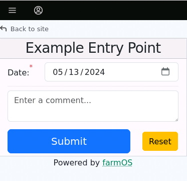

# Working on Entry Points

The purpose of this document is to describe how to create, change and test entry points in FarmData2.

Entry points are pages that provide FarmData2 functionality. The entry points are accessed through the FarmData2 menus (FarmData2, FD2 Examples, FD2 School) that appear in farmOS. For example, the Tray Seeding, Direct Seeding and Transplanting menu options lead to pages (entry points) for collecting data about the corresponding activity.

Familiarity with the [Quick Tour of FarmData2](tour.md) and the [Overview of the FarmData2 Codebase](codebase.md) will be helpful in reading this document.

## Outline

- [Creating a New Entry Point](#creating-a-new-entry-point)
  - [The Entry Point Template](#the-entry-point-template)
  - [Generating a New Entry Point](#generating-a-new-entry-point)
  - [Finding the New Entry Point](#finding-the-new-entry-point)
    - [Finding the Running Entry Point in farmOS](#finding-the-running-entry-point-in-farmos)
    - [Finding the Source Code for the Entry Point](#finding-the-source-code-for-the-entry-point)
  - [Implementing Entry Point Functionality](#implementing-entry-point-functionality)
  - [Watching a Module](#watching-a-module)
  - [Running Entry Point Tests](#running-entry-point-tests)
    - [Running Unit Tests](#running-unit-tests)
    - [Running End-to-End Tests](#running-end-to-end-tests)
- [Tour of an Entry Point](#tour-of-an-entry-point)
  - [Entry Point Directory Structure](#entry-point-directory-structure)
  - [Entry Point Code](#entry-point-code)
    - [The `App.vue` File](#the-appvue-file)
      - [Adding Components to `App.vue`](#adding-components-to-appvue)
      - [`App.vue` Examples](#appvue-examples)
    - [The `lib.js` File](#the-libjs-file)
      - [The `submitForm` Function](#the-submitform-function)
      - [`lib.js` Examples](#libjs-examples)
  - [Entry Point Test Files](#entry-point-test-files)
    - [Entry Point Unit Tests](#entry-point-unit-tests)
      - [Entry Point Unit Test Examples](#entry-point-unit-test-examples)
    - [Entry Point End-to-End Tests](#entry-point-end-to-end-tests)
      - [Entry Point End-to-End Test Examples](#entry-point-end-to-end-test-examples)
    - [More Testing Tips](#more-testing-tips)
  - [More Details](#more-details)
    - [`addEntrypoint.bash` flags](#addentrypointbash-flags)
    - [The Drupal Module Files](#the-drupal-module-files)
    - [Watch Alternatives](#watch-alternatives)
      - [Manual Builds](#manual-builds)
      - [The Dev and Preview Servers](#the-dev-and-preview-servers)
        - [The Dev Server](#the-dev-server)
        - [The Preview Server](#the-preview-server)

## Creating a New Entry Point

### The Entry Point Template

New entry points in FarmData2 are created by customizing an entry point template. The entry point template defines the basic structure for an entry point and provides a small set of functionality. It serves as a starting point for creating new entry points and helps to maintain some structural consistency across entry points.

A running instance of an entry point template can be found by choosing the "Example Entry Point" option in the FD2 Examples menu in the FarmData2 Development Environment. The running entry point template looks as follows:

<a href="images/ExampleEntryPoint.png"></a>

The "Submit" button provided does not submit any data to the farmOS server. Implementing that functionality is part of the customization process.

### Generating a New Entry Point

When you want to add a new entry point to FarmData2, the following command will generate a new entry point from the entry point template as a starting point for you:

```bash
addEntryPoint.bash`
```

This command will prompt you for the following information that will be used to create the new entry point:

1. **The module** in which to create the new entry point. The entry point can be created in the `farm_fd2`, `farm_fd2_examples`, or `farm_fd2_school` module, which correspond to the similarly named FarmData2 menus in farmOS.
1. **The name** for the new entry point. This name is used internally in code and is not visible to users. The name should be entered in `snake_case`, with words being all lowercase and separated by underscore (`_`) characters.
1. **A short title** for the new entry point. The title is the text that will be used as the menu option for accessing the entry point. It also appears at the top of the entry point page. The title should be in Title Case, with words capitalized and separated by spaces. This often uses the same words as the name.
1. A one sentence **description** of the new entry point. This description is used as a tooltip by Drupal and should be written to be meaningful to a user.
1. The **parent menu** on which the option for this entry point should be added. The title for this entry point will appear on the specified menu.
1. The **permissions** that a user must have to see the menu. The permissions that are available can be found by logging into farmOS as `admin` and visiting the [farmOS People page](http://farmos/admin/people/permissions). Then use the browser dev-tools to inspect the check boxes to find the name of the permission.

After confirming the information that you entered, the script will generate the new entry point from the template by:

1. Creating and switching to a new feature branch named `add_<entry_point_name>_entry_point`
2. Creating a subdirectory in the module containing the new entry point.
3. Customizing the entry point template files with the information you entered and copying them into the subdirectory.
4. Updating the module's configuration so that the menu option for the new entry point will appear in farmOS.
5. Running tests to confirm that the new entry point was created.
6. Committing the customized entry point files to the feature branch.

This process typically takes several minutes.

The [`addEntrypoint.bash` flags](#addentrypointbash-flags) section provides some more information about the script.

### Finding the New Entry Point

The running instance of the new entry point can be found in farmOS and the source code for it can be found in your FarmData2 repository.

#### Finding the Running Entry Point in farmOS

Open Mozilla Firefox and login to farmOS at [http://farmos](http://farmos). Then use the FarmData2 menus to find the module containing the new entry point that you created. If the entrypoint page is blank when you visit it the first time, hold the "shift" key and click the reload button in the browser (&#10227;).

#### Finding the Source Code for the Entry Point

The directory for the module in which the new entry point is being created will contain a subdirectory for the new entry point's code.

For example, the subdirectory containing the source code for the `example_entry_point` in the `farm_fd2_examples` is shown in the following directory tree:

<pre>
FarmData2
├── ...
├── modules
│   ├── css
│   ├── farm_fd2
│   │   └── ...
│   ├── farm_fd2_examples
│   │   ├── dist
│   │   ├── src
│   │   |   ├── entrypoints
│   │   |   │   ├── ...
│   │   |   │   ├── component_examples
│   │   |   │   ├── date_selector
│   │   |   │   ├── <strong>example_entry_point</strong>
│   │   |   │   └── ...
|   |   |   ├── module
|   |   |   └── public
│   │   └── vite.config.js
│   └── farm_fd2_school
│       └── ...
:
</pre>

### Implementing Entry Point Functionality

The functionality of the entry point template is customized to its intended purpose by adding components to the page in the `App.vue` file and implementing the `submitForm` function in the `lib.js` file. Each of these files contain comments that describe how to customize the entry point.

The [Tour of an Entry Point](#tour-of-an-entry-point) section provides more detail and examples of how to customize the entry point template.

### Watching a Module

When the source code associated with an entry point is changed, the module containing it needs to be rebuilt for the changes to appear in farmOS.

Most commonly you will want to _watch_ the module containing the entry point on which you are working. Watching the module causes it to be rebuilt any time changes are made to any of the source files that it uses. To watch a module, open a new terminal and use the command for the module containing the entry point on which you are working:

- `npm run watch:fd2`
- `npm run watch:examples`
- `npm run watch:school`

When changes to the source files are saved, output in the terminal will show the module being rebuilt and will report any errors that occur.

The [Watch Alternatives](#watch-alternatives) section describes other approaches to watching or building modules that might be useful or preferred in some circumstances.

### Running Entry Point Tests

New entry points are populated with unit tests and end-to-end tests from the template. These tests check the functionality provided by the template.

They will need to be changed and more tests will need be added as the functionality of the entry point is customized. [Entry Point Test Files](#entry-point-test-files) section describes the conventions that are used for these tests.

#### Running Unit Tests

To run the unit tests for an entry point open a new terminal and adapt the following command:

```text
test.bash --unit --<module> --glob=modules/**/<entry_point_name>/*.unit.cy.js --gui
```

- `<module>` must be one of `fd2`, `examples` or `school`.
- `<entry_point_name>` must be the name of the entry point to test.
- The `--gui` flag causes the tests to run in the Cypress GUI. Omit the `--gui` flag to run the tests _headless_ with results reported in the terminal.
- Omit the `--glob` flag to run the unit tests for all entry points in the module.

#### Running End-to-End Tests

To run the end-to-end (e2e) tests for an entry point open a new terminal and adapt the following command:

```text
test.bash --e2e --live --<module> --glob=modules/**/<entry_point_name>/*.e2e.cy.js --gui
```

- `<module>` must be one of `fd2`, `examples` or `school`.
- `<entry_point_name>` must be the name of the entry point to test.
- The `--gui` flag causes the tests to run in the Cypress GUI. Omit the `--gui` flag to run the tests _headless_ with results reported in the terminal.
- Omit the `--glob` flag to run the e2e tests for all entry points in the module.

## Tour of an Entry Point

The [Example Entry Point](http://farmos/fd2_examples/example_entry_point) contained on the FD2 Examples menu is an example of a new entry point as created by the `addEntrypoint.bash` script. The following sub-sections provide a guide to the structure and functionality of the example entry point. They also provide pointers to more information and links to implemented entry points that will be helpful in customizing new entry points.

### Entry Point Directory Structure

When the `addEntryPoint.bash` script creates a new entry point to a module, it adds a subdirectory for the new entry point to the module. It populates this subdirectory with template files as a starting point for the new entry point. For example, the subdirectory for the `example_entry_point` is shown in the following directory tree:

<pre>
FarmData2
├── modules
│   ├── ...
│   ├── farm_f2
│   ├── farm_fd2_examples
│   │   ├── dist
│   │   ├── src
│   │   |   ├── entrypoints
│   │   |   │   ├── ...
│   │   |   │   ├── <strong>example_entry_point
│   │   |   │   │   ├── App.vue
│   │   |   │   │   ├── example_entry_point.comment.e2e.cy.js
│   │   |   │   |   ├── example_entry_point.date.e2e.cy.js
│   │   |   │   |   ├── example_entry_point.exists.e2e.cy.js
│   │   |   │   |   ├── example_entry_point.html
│   │   |   │   |   ├── example_entry_point.js
│   │   |   │   |   ├── example_entry_point.submission.e2e.cy.js
│   │   |   │   |   ├── example_entry_point.submitReset.e2e.cy.js
│   │   |   │   |   ├── index.html
│   │   |   │   |   ├── lib.js
│   │   |   │   |   ├── lib.submit.unit.cy.js
│   │   |   │   |   └── lib.submitError.unit.cy.js</strong>
│   │   |   │   └── ...
|   |   |   ├── module
|   |   |   └── public
│   │   └── vite.config.js
│   └── farm_f2_school
:
</pre>

- The `App.vue` and `lib.js` files contain the code that implements the entry point.
  - `App.vue` defines the Vue application for the entry point.
  - `lib.js` contains the `submitForm` function that creates the data records for the entry point in the farmOS database.
- The files that end in `.cy.js` contain tests for the entry point.
  - The files that end in `.e2e.cy.js` contain end-to-end tests for the entry point.
  - The `lib.*.unit.cy.js` files contain unit tests for the `submitForm` function in `lib.js`.
- The `index.html`, `example_entry_point.html`, and `example_entry_point.js` are boilerplate for the Vue app and will not need to be edited.

More details on these files and how to customize them for your entry point can be found in the following sub-sections:

- [Entry Point Code](#entry-point-code)
  - [The `App.vue` File](#the-appvue-file)
  - [The `lib.js` File](#the-libjs-file)
- [Entry Point Test Files](#entry-point-test-files)
  - [Entry Point End-to-End Tests](#entry-point-end-to-end-tests)
  - [Entry Point Unit Tests](#entry-point-unit-tests) section.

### Entry Point Code

The following sub-sections provide a guide to the `example_entry_point` and pointers to more information and fully implemented entry points that will served as helpful examples in customizing new entry points. You can follow along by looking at the `example_entry_point` in the `farm_fd2_examples` module, or by having [created a new entry point of your own by using the `addEntryPoint.bash` script](#generating-a-new-entry-point).

#### The `App.vue` File

The `App.vue` file defines a _Vue Single File Component_ (SFC) using the Vue's _Options API_. This SFC is what is displayed when the entry point is visited in farmOS.

If you are not familiar with Vue SFC or Vue's Options API the following resources are great places to start:

- The "Getting Started" and "Essentials" sections of the [Vue Introduction](https://vuejs.org/guide/introduction.html).
- Vue Mastery's [Intro to Vue 3 video course](https://www.vuemastery.com/courses/intro-to-vue-3/intro-to-vue3) are a great place to start.

##### Adding Components to `App.vue`

Vue Components are added to an entry point's `App.vue` file to customize its input form to its purpose. The following resources will be helpful in customizing the entry point's `App.vue` file:

- [`App.vue` in the Example Entry Point](../../modules/farm_fd2_examples/src/entrypoints/example_entry_point/App.vue) contains comments explaining its structure and operation, and to guide its customization for new entry points.
- The ["Component Basics"](https://vuejs.org/guide/essentials/component-basics.html) section of the Vue Introduction shows how to add Vue component to a SFC.
- The [FarmData2 Documentation](http://localhost:8082/docs/FarmData2.md) page provides a links to the documentation for each custom FarmData2 Vue component, a live running example of the component, and a static code example of its use.
  - The guide to [Working on a Vue.js Component](components.md) provides information about creating and testing custom Vue Components for FarmData2.
- The documentation for the [BootstrapVueNext Components](https://bootstrap-vue-next.github.io/bootstrap-vue-next/docs.html). These Vue Components are typically used inside of the custom Vue Components for FarmData2, but might be used directly in an entry point. Note that BootstrapVueNext is under active development and its documentation is evolving with its development. FarmData2 has pinned to a specific version of BootstrapVueNext for stability. There will be inconsistencies between the BootstrapVueNext documentation and the code in FarmData2.

##### `App.vue` Examples

Examples of `App.vue` files can be found in the existing entry points including:

- [`App.vue` in the Tray Seeding entry point](../../modules/farm_fd2/src/entrypoints/tray_seeding/App.vue) contains extra documentation to help it serve as an example.
- `App.vue` files can also be found in [other entry points](../../modules/farm_fd2/src/entrypoints/).

#### The `lib.js` File

The `lib.js` file is a JavaScript library for the entry point. It contains at least the `submitForm` function, which is called when the "Submit" button is clicked. It can also contain other functions that are useful for the entrypoint.

Implementing the `submitForm` and other functions in the `lib.js` file, as opposed to directly in the `App.vue` file, makes it possible to unit test them. See the [Entry Point Unit Tests](#entry-point-unit-tests) section for more details.

##### The `submitForm` Function

When the "Submit" button on a entry point page is clicked, the `submitForm` function in the `lib.js` file is called and the data entered into the form is passed to it as an argument. This function must be customized to its entry point's purpose by using the `farmosUtil` library to create the farmOS assets, logs and quantities needed to represent the entry point's operation.

The following resources will be helpful in customizing the entry point's `submitForm` function:

- [`lib.js` in the Example Entry Point](../../modules/farm_fd2_examples/src/entrypoints/example_entry_point/lib.js) contains a _TODO_ list and comments that describe the customizations that need to be made.
- The [`farmOSUtil` library](../library/farmOSUtil.md) contains methods for creating the farmOS assets, logs and quantities needed to represent the entry point's operation.
  - The [Guide to working on a Library](libraries.md) provides information about extending the `farmosUtil` library to include new functions.

##### `lib.js` Examples

Examples of `lib.js` files can be found in the existing entry points including:

- ['lib.js in the Tray Seeding entry point](../../modules/farm_fd2/src/entrypoints/tray_seeding/lib.js), which contains extra documentation to help it serve as an example.
- `lib.js` files can also be found in [other entry points](../../modules/farm_fd2/src/entrypoints/).

### Entry Point Test Files

Entry points have two types of tests associated with them. The functions in the `lib.js` file have unit tests and the functionality in the `App.vue` file has end-to-end tests.

#### Entry Point Unit Tests

The template files for a new entry point include two unit test files that will need to be customized for your entry point:

- [`lib.submit.unit.cy.js`](../../modules/farm_fd2_examples/src/entrypoints/example_entry_point/lib.submit.unit.cy.js) - tests successful calls to the `submitForm` function in `lib.js`.
- [`lib.submitError.unit.cy.js`](../../modules/farm_fd2_examples/src/entrypoints/example_entry_point/lib.submitError.unit.cy.js) tests unsuccessful calls to the `submitForm` function in the `lib.js` file.

If other functions are added to the `lib.js` file, their unit tests should be placed in a file incorporating their name. For example, if a function named `computeValid` is added then its unit tests should be placed in `lib.computeValid.unit.cy.js`.

##### Entry Point Unit Test Examples

You can find examples of the unit tests for the `submitForm` function in other entry points including:

- [`lib.submit.unit.cy.js`](../../modules/farm_fd2/src/entrypoints/tray_seeding/lib.submit.unit.cy.js) and [`lib.submitError.unit.cy.js`](../../modules/farm_fd2/src/entrypoints/tray_seeding/lib.submitError.unit.cy.js) in the Tray Seeding entry point, which contain extra comments to serve as an example.
- Similar unit test files can also be found in [other entry points](../../modules/farm_fd2/src/entrypoints/).

#### Entry Point End-to-End Tests

The entry point end-to-end tests check that the entry point exists, its components are correct, and that the form passes the correct data to [the `submitForm` function](#the-submitform-function).

The templates for new entry points provides the following end-to-end (e2e) tests that will need to be expanded and customized for new entry points:

- [`example_entry_point.exists.e2e.cy.js`](../../modules/farm_fd2_examples/src/entrypoints/example_entry_point/example_entry_point.exists.e2e.cy.js) - tests that the page exists, can be accessed by appropriate users, and contains the main structural elements of an entry point.
- One test file for each component on the page:
  - [`example_entry_point.date.e2e.cy.js`](../../modules/farm_fd2_examples/src/entrypoints/example_entry_point/example_entry_point.date.e2e.cy.js) - tests the `DateSelector` component.
  - [`example_entry_point.comment.e2e.cy.js`](../../modules/farm_fd2_examples/src/entrypoints/example_entry_point/example_entry_point.comment.e2e.cy.js) - tests the `CommentBox` component.
- [`example_entry_point.submission.e2e.cy.js`](../../modules/farm_fd2_examples/src/entrypoints/example_entry_point/example_entry_point.submission.e2e.cy.js) - tests that the correct data is passed to the `submitForm` function.
- [`example_entry_point.submitReset.e2e.cy.js`](../../modules/farm_fd2_examples/src/entrypoints/example_entry_point/example_entry_point.submitReset.e2e.cy.js) - tests the `SubmitResetButtons` component.

##### Entry Point End-To-End Test Examples

You can find examples of the e2e tests in other entry points including:

- [`tray_seeding.*.e2e.cy.js`](../../modules/farm_fd2/src/entrypoints/tray_seeding/) in the Tray Seeding entry point, which contain extra comments to serve as an example.
- Similar e2e test files can also be found in [other entry points](../../modules/farm_fd2/src/entrypoints/).

### More Testing Tips

The [Tips for Testing in FarmData2](testingTips.md) document provides some more general testing tips that might also be helpful.

## More Details

### `addEntrypoint.bash` flags

Flags can be used with the `addEntrypoint.bash` script to change its behavior.

- The `--dev` flag causes the `addEntrypoint.bash` script to create its new feature branch from the _current_ branch instead of from the `development` branch. This makes it easier to test changes that are being made to the template files.

- Other flags may be added in the future.

### The Drupal Module Files

The `module` and `public` directories in each of the FarmData2 modules contains the files needed to build the associated Drupal module that plugs into farmOS.

Typically, these files will not need to be modified manually. The `addEntrypoint.bash` script will automatically add the information for the new entry point to the appropriate module files. If you find yourself manually editing these files, check with one of the project maintainers on the [FarmData2 Zulip Chat](https://farmdata2.zulipchat.com). They can confirm that is the appropriate approach for what you are trying to do.

### Watch Alternatives

[Watching a Module](#watching-a-module) rebuilds the module when files change so that the changes appear in the live farmOS instance.

FarmData2 provides several other ways that modules can be watched, built, and tested.

#### Manual Builds

The modules can be built manually with the following commands:

- `npm run build:fd2`
- `npm run build:examples`
- `npm run build:school`

#### The Dev and Preview Servers

Two servers enable the Vue applications in each of the FarmData2 modules to be viewed and tested outside of the live farmOS instance.

##### The Dev Server

The dev server serves dynamically built versions of the Vue application in a FarmData2 modules. It also watches the files in the module for changes and dynamically updates the app that is running in the browser.

The dev server can be started for a module with the following commands:

- `npm run dev:fd2`
- `npm run dev:examples`
- `npm run dev:school`

With the dev server running, a module's entry points can be accessed in the browser by adapting the following URL:

```text
http://localhost:5173/fd2/< entry point name >
```

For example, to access the Tray Seeding entry point run the dev server for the `fd2` module and adapt the following URL:

```text
http://localhost:5173/fd2/tray_seeding
```

The end-to-end tests for a module can also be run by using the dev server instead of the live server by adapting the following command:

```text
test.bash --e2e --dev --<module> --glob=modules/**/<entry_point_name>/*.e2e.cy.js --gui
```

##### The Preview Server

The preview server serves statically built versions of the Vue application in a FarmData2 modules.

- `npm run preview:fd2`
- `npm run preview:examples`
- `npm run preview:school`

With the preview server running, a module's entry points can be accessed in the browser by adapting the following URL:

```text
http://localhost:4173/fd2/<entry_point_name>
```

For example, to access the Tray Seeding entry point run the preview server for the `fd2` module and adapt the following URL:

```text
http://localhost:4173/fd2/tray_seeding
```

The end-to-end tests for a module can also be run by using the preview server instead of the live server by adapting the following command:

```text
test.bash --e2e --preview --<module> --glob=modules/**/<entry_point_name>/*.e2e.cy.js --gui
```
