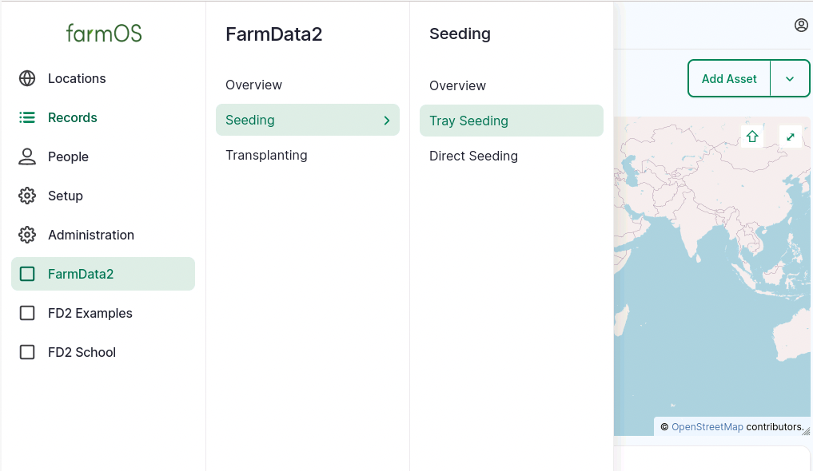
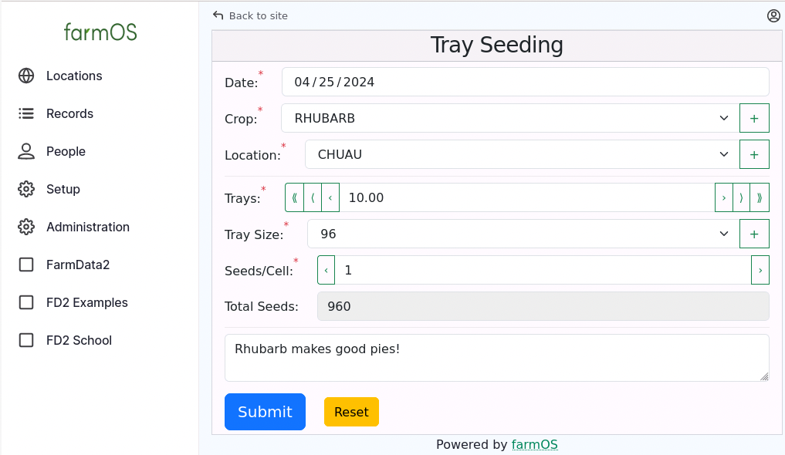
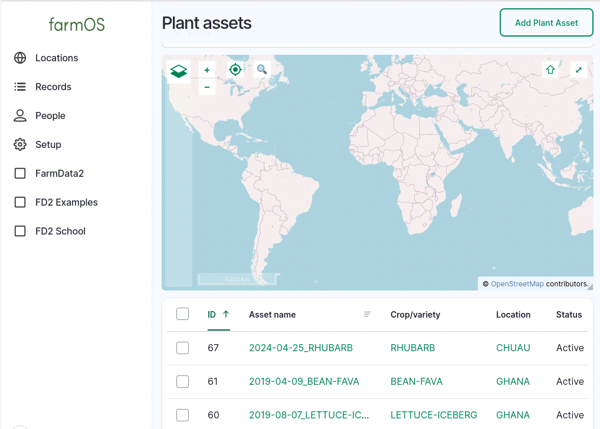
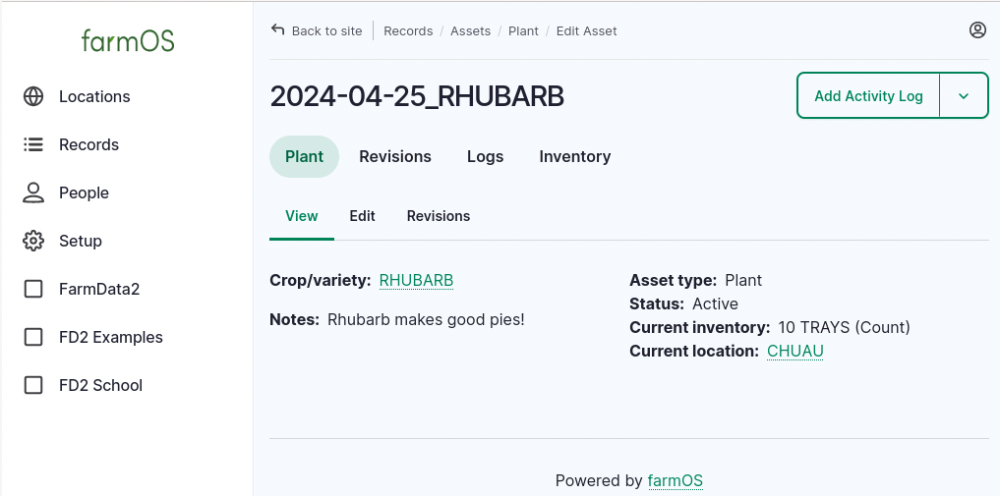
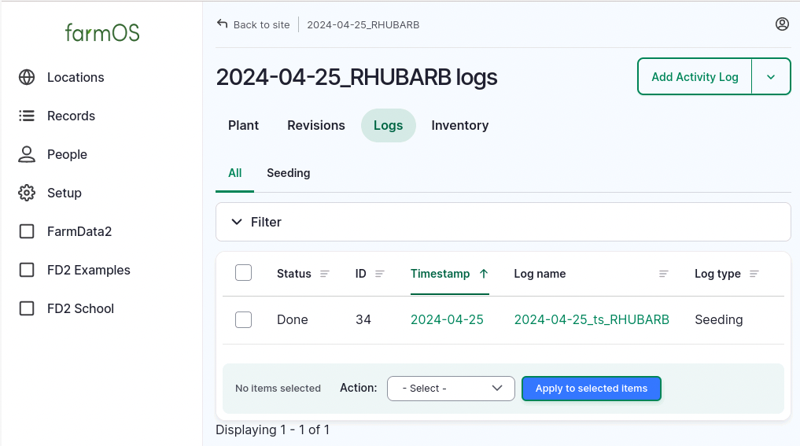
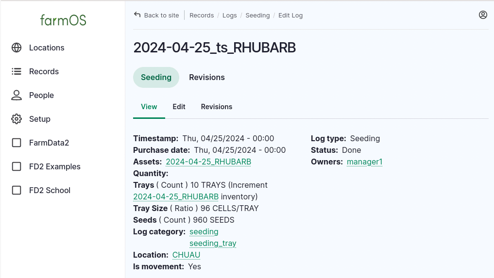
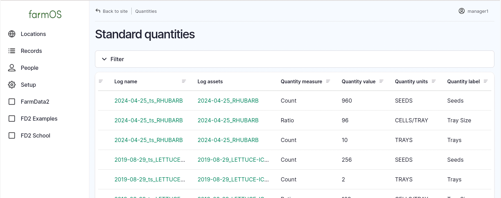
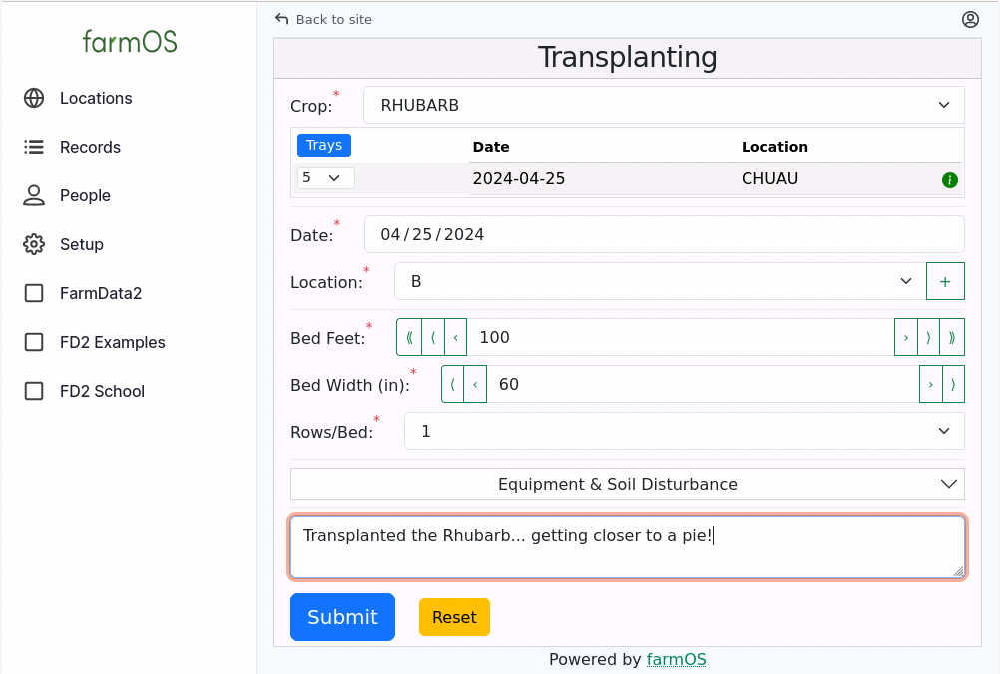
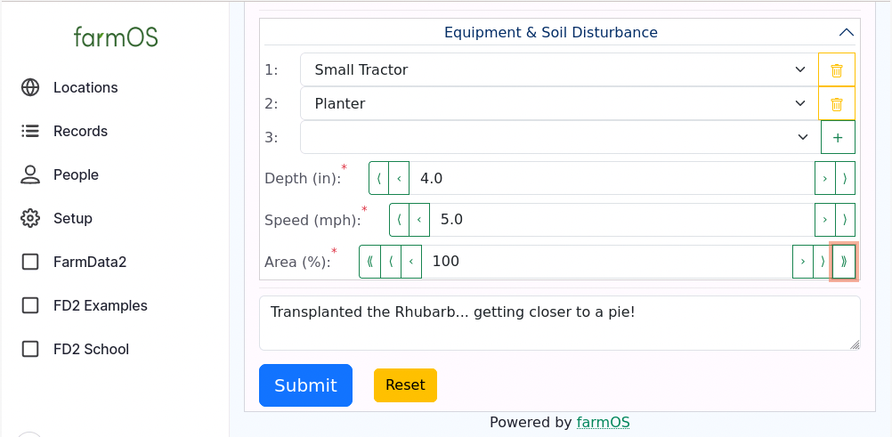

# A Quick Tour of FarmData2

Once you have [installed the FarmData2 Development Environment](../../INSTALL.md) and have a running instance of FarmData2 it may be useful to work through a quick tour. This tour will not demonstrate every feature of FarmData2, but it will give you a feel for how it works, what it does and how it interfaces with farmOS.

## Creating a Tray Seeding

1. [Login to farmOS](http://farmos) and using the [credentials for a manager](../install/credentials.md#farmos-credentials).

2. Use the _farmOS menu_ on the left and select "FarmData2 -> Seeding -> Tray Seeding" If the farmOS menu is not present, make your browser window a little wider or click the "Hamburger" icon ((&#9776;)) in the top left.

   

3. Complete the Tray Seeding form using whatever values you would like.

   

4. Click the "Submit" button.

   FarmData will show a green banner at the top of the screen with the text "Tray Seeding created.", indicating that the records for the tray seeding have been created in farmOS.

## farmOS Assets, Logs and Quantities

farmOS uses

- _assets_ to represent _things_,
- _logs_ to represent _actions_ related to those things, and
- _quantities_ to represent an _amount_ of something related to an action.

For example, when the tray seeding above was created FarmData2 created:

- a _plant asset_ representing the trays of Rhubarb,
- a _seeding log_ representing the action of creating the tray seeding, and
- three _quantities_ representing the number of trays, the number of cells per tray and the number of seeds that were used.

FarmData2 will have created a similar set of assets, logs and quantities were created when you submitted your tray seeding.

The farmOS menu provides access to these assets, logs and quantities.

### Assets

5. Use the farmOS menu to select "Records -> Assets -> Plant".

   A number of plant assets will be listed below the map. Most of these are the sample data provided by the FarmData2 Development Environment for testing purposes.

6. Click on the "ID" column header to sort the assets by their ID number. This will bring the Rhubarb tray seeding asset to the top of the list.

   

7. Click on the "Asset Name" of the tray seeding asset that you created to see more details about the asset.

   

   Notice that a "Current inventory" is listed giving the number of trays that you tray seeded. FarmData2 uses this information to track the number of trays that are available for transplanting.

### Logs

8. Click the "Logs" header at the top of the asset details page to display the logs associated with your plant asset.

   

9. Click on the "Log name" of for the seeding log that you created to display more details about the log.

   

   Notice that these details include things such as:

   - The date (_Timestamp_) when the tray seeding occurred.
   - A link back to the associated plant asset.
   - Some quantities associated with the tray seeding:
     - The number of trays that were seeded (_Trays_). Notice that this value _increments_ the plant asset's inventory of trays.
     - The number of cells per tray (_Tray Size_).
     - The number of seeds that were used (_Seeds_).

### Quantities & Inventory

Quantities are most often observed by looking at a log or an inventory value associated with an asset, as you did above. However, they are independent records within farmOS and are created by FarmData2 code when the Tray Seeding is submitted. Thus, it is worth knowing how to access them in farmOS.

10. Use the farmOS menu to select "Records -> Quantities -> Standard".

    Scrolling to the right will reveal columns that show the _Quantity value_, _Quantity units_ and _Quantity label_ for each of the quantities. There should be quantities with labels of _Seeds_, _Tray Size_ and _Trays_ and values that agree with the tray seeding that you created.

    

## Transplanting a Tray Seeding

When tray seedings are created they are then available to be transplanted.

11. Use the farmOS menu to select "FarmData2 -> Transplanting".

12. Use the "Crop" dropdown to select the crop that you tray seeded. The details of your tray seeding will appear in the table below the crop.

13. Select some number of, but not all of, the trays to transplant from the "Trays" column.

14. Complete the remainder of the currently visible parts of the "Transplanting Form".

    

### Equipment and Soil Disturbances

When operations, such as transplanting, use equipment and disturb the soil, FarmData2 provides the option to enter information about the equipment used and how the soil was disturbed. This data can be useful for studies of soil health (e.g. [Pasa Soil Health Benchmark Study](https://pasafarming.org/soil-health-benchmark-study/) and the [STIR: Soil Tillage Intensity Rating](https://www.nrcs.usda.gov/sites/default/files/2022-11/CEAP-Croplands-2008-Methodology-SoilTillageIntensityRating.pdf)).

15. Click the down arrowhead (&#8897;) to open the "Equipment & Soil Disturbance" section of the Transplanting form.

16. Select some equipment and add some information about the soil disturbance.

    

17. Click the "Submit" button.

    FarmData will show a green banner at the top of the screen with the text "Transplanting created.", indicating that the records for the transplanting have been created in farmOS.

### More farmOS Assets, Logs and Quantities

As when you created a tray seeding, when a transplanting is submitted FarmData2 creates a number of _assets_, _logs_ and _quantities_ that represent the transplanted crop, the transplanting action, the soil disturbance and the associated quantities.

18. You can use the "Assets", "Logs" and "Quantities" options on the "farmOS -> Records" menu to view the following records that are created or modified by the transplanting:
    - A _plant asset_ representing the transplanted crop.
    - A decrease in the "TRAYS" inventory on the original _plant asset_.
    - An _activity log_ representing the action of transplanting the crop with quantities for:
      - The number of trays that were transplanted (_Trays_). Note that this _decrements_ the inventory of the original plant asset.
      - The amount of bed used for the transplanted crop (_Bed Feet_, _Row Feet_).
      - The width of the beds into which the plant is transplanted (_Bed Width_).
      - The number of rows in the beds (_Rows/Bed_).
    - An -activity log\_ representing the soil disturbance with quantities for:
      - The depth to which the soil was disturbed (_Depth_).
      - The speed at which equipment was used when doing the transplanting (_Speed_).
